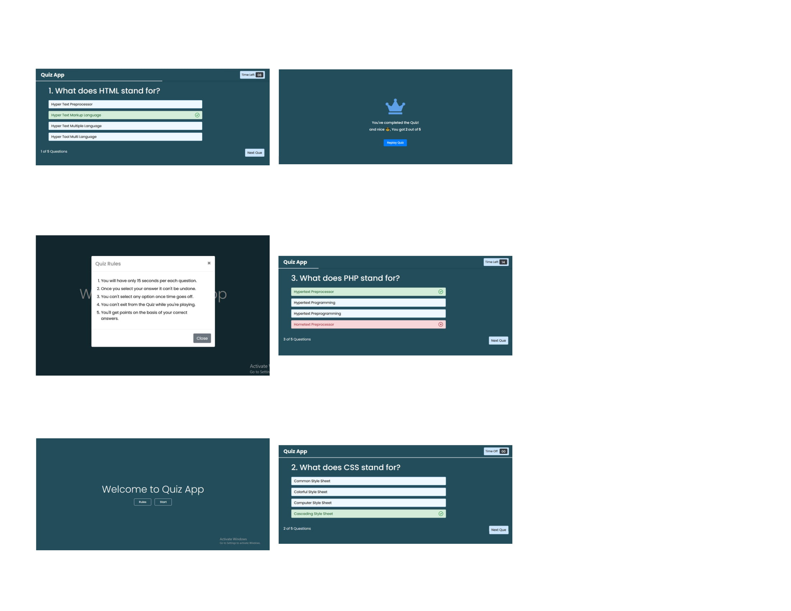

# Project Name
> ## Quiz Application using Javascript.

# Table of contents
* [General info](#general-info)
* [Screenshots](#screenshots)
* [Technologies](#technologies)
* [Setup](#setup)

# General info
### It’s a Quiz Application where there are Five Question and you have to answer the question within 15 seconds. At the end you are notified what answer is correct or wrong and your marks.

# Screenshots

# Technologies
* ### HTML
* ### CSS
* ### Javascript
* ### jQuery

# Setup
### Download the project and open the index.html file to your browser. Enjoy the Quiz app.
